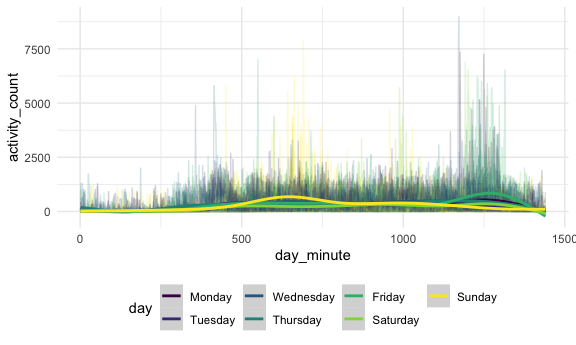

Homework 3
================
Lunbei Hu
2020-10-10

This is my solution to HW2.

### Problem 1

``` r
data("instacart")
```

This dataset contains 1384617 rows and 15 columns.

Observations are the level of items in orders by user. There are
user/order variables – user ID, order ID, order day and order hour.
There are also item variables – name, aisle, department, and some
numeric codes.

How many aisles, and which are most items from?

``` r
instacart %>% 
  count(aisle) %>% 
  arrange(desc(n))
```

    ## # A tibble: 134 x 2
    ##    aisle                              n
    ##    <chr>                          <int>
    ##  1 fresh vegetables              150609
    ##  2 fresh fruits                  150473
    ##  3 packaged vegetables fruits     78493
    ##  4 yogurt                         55240
    ##  5 packaged cheese                41699
    ##  6 water seltzer sparkling water  36617
    ##  7 milk                           32644
    ##  8 chips pretzels                 31269
    ##  9 soy lactosefree                26240
    ## 10 bread                          23635
    ## # … with 124 more rows

Let’s make a plot

``` r
instacart %>% 
  count(aisle) %>% 
  filter(n > 10000) %>% 
  mutate(
    aisle = factor(aisle),
    aisle = fct_reorder(aisle, n)
  ) %>% 
  ggplot(aes(x = aisle, y = n)) +
  geom_point() +
  theme(axis.text.x = element_text(angle = 90, vjust = 0.5, hjust = 1))
```


Let’s make a table\!\!

``` r
instacart %>% 
  filter(aisle %in% c("baking ingredients", "dog food care", "packaged vegetables fruits")) %>% 
  group_by(aisle) %>% 
  count(product_name) %>% 
  mutate(rank = min_rank(desc(n))) %>% 
  filter(rank < 4) %>% 
  arrange(aisle, rank) %>%
  knitr::kable()
```

| aisle                      | product\_name                                 |    n | rank |
| :------------------------- | :-------------------------------------------- | ---: | ---: |
| baking ingredients         | Light Brown Sugar                             |  499 |    1 |
| baking ingredients         | Pure Baking Soda                              |  387 |    2 |
| baking ingredients         | Cane Sugar                                    |  336 |    3 |
| dog food care              | Snack Sticks Chicken & Rice Recipe Dog Treats |   30 |    1 |
| dog food care              | Organix Chicken & Brown Rice Recipe           |   28 |    2 |
| dog food care              | Small Dog Biscuits                            |   26 |    3 |
| packaged vegetables fruits | Organic Baby Spinach                          | 9784 |    1 |
| packaged vegetables fruits | Organic Raspberries                           | 5546 |    2 |
| packaged vegetables fruits | Organic Blueberries                           | 4966 |    3 |

Apples vs ice cream.

``` r
instacart %>% 
  filter(product_name %in% c("Pink Lady Apples", "Coffee Ice Cream")) %>% 
  group_by(product_name, order_dow) %>% 
  summarize(mean_hour = mean(order_hour_of_day)) %>% 
  pivot_wider(
    names_from = order_dow,
    values_from = mean_hour
  )
```

    ## `summarise()` regrouping output by 'product_name' (override with `.groups` argument)

    ## # A tibble: 2 x 8
    ## # Groups:   product_name [2]
    ##   product_name       `0`   `1`   `2`   `3`   `4`   `5`   `6`
    ##   <chr>            <dbl> <dbl> <dbl> <dbl> <dbl> <dbl> <dbl>
    ## 1 Coffee Ice Cream  13.8  14.3  15.4  15.3  15.2  12.3  13.8
    ## 2 Pink Lady Apples  13.4  11.4  11.7  14.2  11.6  12.8  11.9

### Problem 2

Load the accelerometers data.

``` r
accel_df =
  read.csv("./data/accel_data.csv") %>% 
  janitor::clean_names() %>% 
  pivot_longer(
    activity_1:activity_1440,
    names_to = "day_minute",
    names_prefix = "activity_",
    values_to = "activity_count"
  ) %>% 
  mutate(
    day = factor(day),
    day = forcats::fct_relevel(day, c("Monday", "Tuesday", "Wednesday", "Thursday", "Friday", "Saturday", "Sunday")),
    week_day = case_when(
      day %in% c("Monday","Tuesday","Wednesday","Thursday","Friday") ~ "weekday",
      day %in% c("Saturday","Sunday") ~ "weekend"
    )
  )
```

Create a table on the total activity over the day.

``` r
accel_df %>% 
  group_by(week,day) %>% 
  summarize(total_activity = sum(activity_count)) %>% 
  pivot_wider(
    names_from = day,
    values_from = total_activity
  ) %>% 
  knitr::kable()
```

    ## `summarise()` regrouping output by 'week' (override with `.groups` argument)

| week |    Monday |  Tuesday | Wednesday | Thursday |   Friday | Saturday | Sunday |
| ---: | --------: | -------: | --------: | -------: | -------: | -------: | -----: |
|    1 |  78828.07 | 307094.2 |    340115 | 355923.6 | 480542.6 |   376254 | 631105 |
|    2 | 295431.00 | 423245.0 |    440962 | 474048.0 | 568839.0 |   607175 | 422018 |
|    3 | 685910.00 | 381507.0 |    468869 | 371230.0 | 467420.0 |   382928 | 467052 |
|    4 | 409450.00 | 319568.0 |    434460 | 340291.0 | 154049.0 |     1440 | 260617 |
|    5 | 389080.00 | 367824.0 |    445366 | 549658.0 | 620860.0 |     1440 | 138421 |

Make a single-panel plot that shows the 24-hour activity time courses
for each day.

``` r
accel_df %>% 
  mutate(day_minute = as.numeric(day_minute)) %>% 
  ggplot(aes(x = day_minute, y = activity_count, group = day_id, color = day)) +
  geom_line(alpha = .2) +
  geom_smooth(aes(group = day)) 
```

    ## `geom_smooth()` using method = 'gam' and formula 'y ~ s(x, bs = "cs")'


